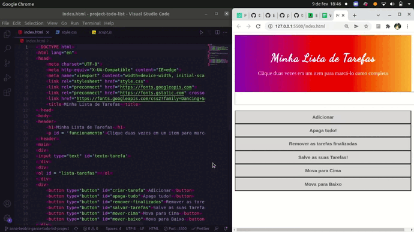

Este projeto contém os requisitos realizados por _[Anna Beatriz Garcia Trajano de Sá](www.linkedin.com/in/anna-beatriz-trajano-de-sá)_ enquanto estudava na [Trybe](https://www.betrybe.com/) :rocket:


# Project To do List

Desenvolvi uma lista de tarefas usando HTML, CSS e JavaScript.

Veja o exemplo a seguir do layout do projeto!

## Demo



## Instalação do projeto localmente:
 
Após cada um dos passos, haverá um exemplo do comando a ser digitado para fazer o que está sendo pedido, caso tenha dificuldades e o exemplo não seja suficiente, não hesite em me contatar em _annagarcia@id.uff.br_ 

1. Abra o terminal e crie um diretório no local de sua preferência com o comando **mkdir**:
```javascript
  mkdir projetos
```

2. Entre no diretório que acabou de criar e depois clone o projeto:
```javascript
  cd projetos
  git clone git@github.com:annabia95/project-todo-list.git
```

Para evitar problemas de CORS, utilize a extensão Live Server do VSCode para conseguir carregar todos os assets externos, com o servidor rodando, abra o arquivo index.html, não é necessário rodar um npm install para ver a aplicação

## Habilidades Desenvolvidas

Neste projeto, desenvolvi as seguintes habilidades:

- Manipular CSS

- Manipular Javascript

## Escopo do Projeto

    `Requisitos obrigatórios:`
    - [x] [1 - Adicone à sua lista o título "Minha Lista de Tarefas" em uma tag <header>](#1---adicone-à-sua-lista-o-título-minha-lista-de-tarefas-em-uma-tag-)
    - [x] [2 - Adicione abaixo do título um pequeno e discreto parágrafo com id="funcionamento" e com o texto "Clique duas vezes em um item para marcá-lo como completo"](#2---adicione-abaixo-do-título-um-pequeno-e-discreto-parágrafo-com-idfuncionamento-e-com-o-texto-clique-duas-vezes-em-um-item-para-marcá-lo-como-completo)
    - [x] [3 - Adicione um input com o id="texto-tarefa" onde o usuário poderá digitar o nome do item que deseja adicionar à lista](#3---adicione-um-input-com-o-idtexto-tarefa-onde-o-usuário-poderá-digitar-o-nome-do-item-que-deseja-adicionar-à-lista)
    - [x] [4 - Adicione uma lista ordenada de tarefas com o id="lista-tarefas"](#4---adicione-uma-lista-ordenada-de-tarefas-com-o-idlista-tarefas)
    - [x] [5 - Adicione um botão com id="criar-tarefa" e, ao clicar nesse botão, um novo item deverá ser criado ao final da lista e o texto do input deve ser limpo](#5---adicione-um-botão-com-idcriar-tarefa-e-ao-clicar-nesse-botão-um-novo-item-deverá-ser-criado-ao-final-da-lista-e-o-texto-do-input-deve-ser-limpo)
    - [x] [6 - Ordene os itens da lista de tarefas por ordem de criação](#6---ordene-os-itens-da-lista-de-tarefas-por-ordem-de-criação)
    - [x] [7 - Clicar em um item da lista deve alterar a cor de fundo do item para cinza rgb(128,128,128)](#7---clicar-em-um-item-da-lista-deve-alterar-a-cor-de-fundo-do-item-para-cinza-rgb128128128)
    - [x] [8 - Não deve ser possível selecionar mais de um elemento da lista ao mesmo tempo](#8---não-deve-ser-possível-selecionar-mais-de-um-elemento-da-lista-ao-mesmo-tempo)
    - [x] [9 - Clicar duas vezes em um item, faz com que ele seja riscado, indicando que foi completo. Deve ser possível desfazer essa ação clicando novamente duas vezes no item](#9---clicar-duas-vezes-em-um-item-ele-deverá-ser-riscado-indicando-que-foi-completo-deve-ser-possível-desfazer-essa-ação-clicando-novamente-duas-vezes-no-item)
    - [x] [10 - Adicione um botão com id="apaga-tudo" que quando clicado deve apagar todos os itens da lista](#10---adicione-um-botão-com-idapaga-tudo-que-quando-clicado-deve-apagar-todos-os-itens-da-lista)
    - [x] [11 - Adicione um botão com id="remover-finalizados" que quando clicado remove **somente** os elementos finalizados da sua lista](#11---adicione-um-botão-com-idremover-finalizados-que-quando-clicado-remove-somente-os-elementos-finalizados-da-sua-lista)

    `Requisitos bônus:`
    - [x] [12 - Adicione um botão com id="salvar-tarefas" que salve o conteúdo da lista. Se você fechar e reabrir a página, a lista deve continuar no estado em que estava](#12---adicione-um-botão-com-idsalvar-tarefas-que-salve-o-conteúdo-da-lista-se-você-fechar-e-reabrir-a-página-a-lista-deve-continuar-no-estado-em-que-estava)
